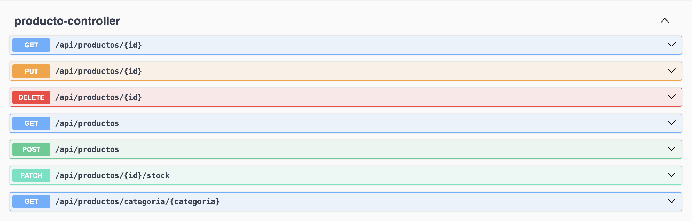
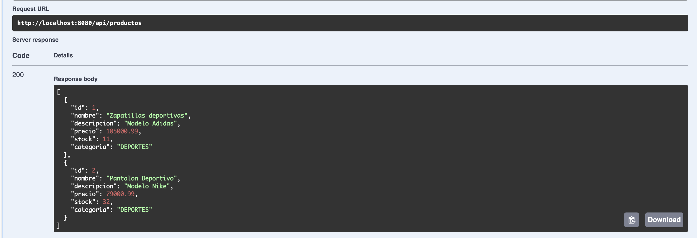
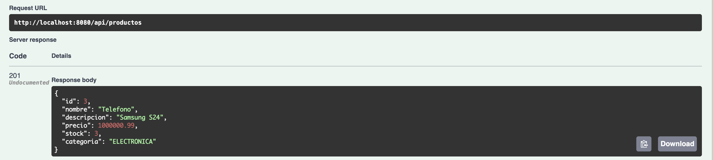
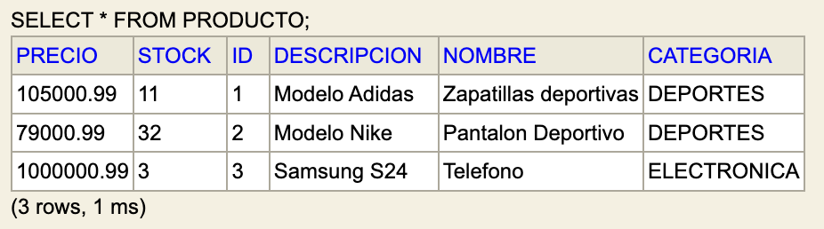

# 🧩 API REST – Gestión de Productos

**Trabajo Práctico – APIREST**

## 👨‍💻 Autor

**Luciano Paulucci - 49089**  
Facultad Regional Mendoza – Universidad Tecnológica Nacional  
Cátedra: Desarrollo de Software

---

## 📘 Descripción

Este proyecto implementa una **API REST** para gestionar productos de un sistema de e-commerce.  
Permite realizar operaciones CRUD completas, filtrar por categoría, actualizar stock y manejar errores de forma centralizada.  
El desarrollo se realizó con **Spring Boot 3.5.7**, **Java 21**, **JPA/Hibernate**, **H2 Database** y **Swagger/OpenAPI**.

---

## ⚙️ Tecnologías utilizadas

- Java 21 ☕
- Spring Boot 3.5.7
- Spring Data JPA
- Hibernate ORM
- Base de datos H2 (en memoria)
- Validaciones con Jakarta Validation (`@Valid`, `@NotNull`, `@Size`, etc.)
- Manejo global de excepciones (`@ControllerAdvice`)
- Swagger / OpenAPI 2.7.0
- IntelliJ IDEA

---

## 🏗️ Arquitectura del proyecto

```
src/main/java/com/utn/productos/
├── controller/          → Controladores REST
├── dto/                 → Data Transfer Objects
├── exception/           → Excepciones y manejadores globales
├── model/               → Entidades (Producto, Categoria)
├── repository/          → Interfaces JPA
├── service/             → Lógica de negocio
└── ProductosApiApplication.java
```

---

## 🧠 Endpoints principales

| Método   | Endpoint                              | Descripción                        |
|:---------|:--------------------------------------|:-----------------------------------|
| `GET`    | `/api/productos`                      | Lista todos los productos          |
| `GET`    | `/api/productos/{id}`                 | Obtiene un producto por su ID      |
| `GET`    | `/api/productos/categoria/{categoria}`| Filtra productos por categoría     |
| `POST`   | `/api/productos`                      | Crea un nuevo producto             |
| `PUT`    | `/api/productos/{id}`                 | Actualiza un producto completo     |
| `PATCH`  | `/api/productos/{id}/stock`           | Actualiza solo el stock            |
| `DELETE` | `/api/productos/{id}`                 | Elimina un producto                |

---

## 💾 Configuración de la base de datos

**Archivo:** `src/main/resources/application.properties`

```properties
spring.datasource.url=jdbc:h2:mem:productosdb
spring.datasource.driverClassName=org.h2.Driver
spring.datasource.username=sa
spring.datasource.password=
spring.h2.console.enabled=true
spring.h2.console.path=/h2-console
spring.jpa.hibernate.ddl-auto=create-drop
spring.jpa.show-sql=true
```

**Consola H2 disponible en:** 👉 http://localhost:8080/h2-console

---

## 🌐 Documentación Swagger

La documentación interactiva se encuentra disponible en:

👉 **http://localhost:8080/swagger-ui/index.html**

Desde ahí se pueden probar todos los endpoints directamente desde el navegador.

---

## 🧪 Ejemplo de prueba (POST)

**URL:** `http://localhost:8080/api/productos`

**Body JSON:**

```json
{
  "nombre": "Zapatillas deportivas",
  "descripcion": "Modelo 2025 running",
  "precio": 49999.99,
  "stock": 15,
  "categoria": "DEPORTES"
}
```

**Respuesta:**

```json
{
  "id": 1,
  "nombre": "Zapatillas deportivas",
  "descripcion": "Modelo 2025 running",
  "precio": 49999.99,
  "stock": 15,
  "categoria": "DEPORTES"
}
```

---

## ⚠️ Ejemplo de error (404)

**URL:** `GET /api/productos/99`

**Respuesta:**

```json
{
  "timestamp": "2025-11-11T03:17:52.456Z",
  "status": 404,
  "error": "Producto con ID 99 no encontrado",
  "path": "/api/productos/99"
}
```

---

## 📸 Capturas sugeridas para entrega

1. **Swagger UI** listado de endpoints

2. **Swagger UI** get productos

3. **Swagger UI** post productos

4. **H2** mostrando la tabla de productos


---